<link href="https://fonts.googleapis.com/css2?&family=Pacifico&family=Roboto+Mono:wght@500&family=Roboto:wght@500&display=swap" rel="stylesheet">

<style>


.important {
    font-size: 22px;
    text-align: center;
    margin: 18px auto;
    color: red; 
}
.title {
    font-size: 46px;
}

img {
    display: flex;
    margin: auto;
    /* min-width: 40%; */
    width: 80%;
}

.sansserif {
  font-family: 'Roboto';
}
.serif {
  font-family: 'Times new roman' serif;
}
.monospace {
  font-family: 'Roboto Mono';
}
.handwriting {
  font-family: 'Pacifico';
}
.fonts {
}
.google {
  margin: auto;
  width: 75%;
  text-align: center;
  background: rgba(127,127,127,0.2);
  padding: 10px 20px 0 20px;
}
</style>

**<h1 class="title">Typografia na webe</h1>**

Jakub Hromádka, Vladislav Sedláček, Alex Štefaňák

<br>


# Obsah

- [Obsah](#obsah)
- [1. typy pisma a texty](#1-typy-pisma-a-texty)
  - [<div class="sansserif fonts">Sans Serif (bezpätkové)</div>](#div-classsansserif-fontssans-serif-bezpätkovédiv)
  - [<div class="serif fonts">Serif (pätkové)</div>](#div-classserif-fontsserif-pätkovédiv)
  - [<div class="monospace fonts">Monospace (Neproporcionálne)</div>](#div-classmonospace-fontsmonospace-neproporcionálnediv)
  - [<div class="handwriting fonts">Handwriting (Písané rukou)</div>](#div-classhandwriting-fontshandwriting-písané-rukoudiv)
  - [Zrozumiteľnosť](#zrozumiteľnosť)
  - [Čitateľnosť](#čitateľnosť)
  - [Kontext](#kontext)
- [2. Ako typografia ovplyvňuje správanie zákazníkov](#2-ako-typografia-ovplyvňuje-správanie-zákazníkov)
- [3. Základné pojmy typografie](#3-základné-pojmy-typografie)
- [4. Jazyky používané pri tvorbe webu](#4-jazyky-používané-pri-tvorbe-webu)
  - [JavaScript](#javascript)
  - [PHP](#php)
  - [HTML a CSS](#html-a-css)
- [5. Rozlozenie a prvky stranky](#5-rozlozenie-a-prvky-stranky)
  - [Single page application](#single-page-application)
  - [Personalne portfolio vs eshop](#personalne-portfolio-vs-eshop)
  - [Zlaty rez](#zlaty-rez)
  - [Kompozícia a kontrasty vo wireframe modeloch](#kompozícia-a-kontrasty-vo-wireframe-modeloch)
  - [Logo stranky klikatelne](#logo-stranky-klikatelne)
  - [Slider vs banner](#slider-vs-banner)
- [6. optimalizacia obrazkov](#6-optimalizacia-obrazkov)
  - [Rozlisenie](#rozlisenie)
  - [Pouzitie CDN](#pouzitie-cdn)
- [Zdroje](#zdroje)

<div style="page-break-after: always;"></div>


# 1. typy pisma a texty

## <div class="sansserif fonts">Sans Serif (bezpätkové)</div>

> Je typografické písmo neobsahujúce serify (pätky). Pojem sans-serif pochádza z angličtiny, kde vznikol použitím francúzskej predložky sans, „bez“ a výrazu serif nejasného pôvodu. V typografii sa pre bezpätkové písma používa tiež pojem grotesk, zatiaľ čo bežné pätkové písmo sa nazýva antikva.

>  Výhody 
>> - veľmi dobrá čitateľnosť pri veľkých textoch (plagáty, billboardy) alebo naopak malých veľkostiach písma (popisky, vysvetlivky)
>
>> - moderný a jednoduchý vzhľad
>
>> - mnoho druhov písiem – viac rôznych hrúbok písma
>
>> - výraznejšie ako pätkové písma, prilákajú viac pozornosti


> Nevýhody 
>> - zhoršená čitateľnosť pri väčších blokoch textu
>
>> - v porovnaní s pätkovými písmami nevyzerajú tak „honosne“

## <div class="serif fonts">Serif (pätkové)</div>
> Pätky písma (anglicky serif) sú kolmé zakončenia ťahov písmen, ktoré vizuálne pomáhajú držať rovinu riadka. Najznámejším pätkovým písmom (fontom) je (aj vďaka Windowsu) Times New Roman.
  
> Pätkové písmo je typografy odporúčané pre dlhé state (obsahy celých kapitol, článkov atp.), pretože pätky pri základnej čiare sa lepšie spájajú do tejto pomyselnej línie a vedú po nej oči čitateľa.

<div class="google">


<p>Google zmenil svoje logo z serif na sans serif</p>
</div>

<br>

## <div class="monospace fonts">Monospace (Neproporcionálne)</div>
> Tiež označované ako písmo s pevnou šírkou , je druh fontu, v ktorom majú všetky znaky rovnakú šírku. Protikladom je písmo proporcionálne, kde sú jednotlivé písmená a medzery medzi nimi rôzne široké. Napríklad písmená „I“ a „E“ nevyžadujú rovnaké množstvo priestoru, takže v písmach proporcionálnych bude prvé z nich užšie ako to druhé. V písme neproporcionálnom by však každé z nich zaberalo rovnaký priestor.

> Problém neproporcionálneho písma je v tom, ako vždy rovnaký priestor pre jeden znak pokiaľ možno rovnomerne vyplniť, či už je to písmeno „I“ alebo „M“. Často sa na to využívajú pätky, ktorými sa úzke znaky dajú rozšíriť. Preto aj bezpätkové neproporcionálne písma opatrujú aspoň písmená „i“ a „l“ malými serifmi.

> V súčasnosti sa využívajú predovšetkým pri písaní a zobrazovaní zdrojového kódu v programovní. Ich výhoda je že vďaka svojmu vzhľadu umožňujú lepšiu vizuálnu kontrolu kódu, formátovanie kódu, zlepšujú čitateľnosť a sprehľadňujú syntax.


```C
#include <stdio.h>
int main()
{
    printf("Hello world");
    return 0;
}
```

## <div class="handwriting fonts">Handwriting (Písané rukou)</div>

> Handwriting fonty sú fonty, ktoré vyzerajú akoby boli napísané rukou, sú napísané jedným ťahom.
>
> Ich hlavné využitie je pri logách, na webe sa málokedy dajú použiť.
>
> Nemožeme meniť ich medziznakovú medzeru, lebo potom by sa na seba písmená nenapájali správne.


<br>

 To, nakoľko je font dobrý, dokážeme posúdiť na základe troch parametrov. Tieto parametre sú:
>
>> 1. zrozumiteľnosť
>
>> 2. čitateľnosť
>
>> 3. kontext

## Zrozumiteľnosť

> Zrozumiteľnosť sa týka schopnosti čitateľov ľahko porozumieť písmenám alebo znakom. Niektoré typy fontov, ako napríklad Arial alebo Helvetica, sú čitateľnejšie ako iné. Práve preto sú v online svete jednoduché fonty užitočnejšie. Zrozumiteľnosť fontu je priamo previazaná s jeho anatómiou.

> Prepracované ozdobné písma a skripty sú často menej čitateľné a vyžadujú si od ľudí viac pozornosti. Veľa dizajnérov sa snaží dosiahnuť atraktívny vizuál práve tým, že použije “fancy” okrasný font, čím v konečnom dôsledku zníži čitateľnosť vizuálu. Je dôležité počítať aj s tým, že bežne používané a jednoduché fonty nemusia byť za určitých okolností čitateľné (napríklad použitím príliš malej veľkosti fontu. Viac o tom, na čo si dávať pozor, sa dočítate nižšie v článku).

## Čitateľnosť

> Čitateľnosť definuje, ako ľahko sú slová v blokoch textu čitateľné. Je dôležité zamerať sa na detaily a dbať na kombináciu čitateľnosti fontu a zrozumiteľnosti jeho znakov, pretože samotný font bude vo veľkej miere rozhodovať o čitateľnosti vašej stránky.

>Faktory, ktoré ovplyvňujú čitateľnosť textu:
>> Veľkosť písma
>
>> Dĺžka riadku
>
>> Zarovnanie textu
>
>> Riadkovanie
>
>> Vzdialenosť medzi písmenami
>
>> Farba písma
>
>> Farba pozadia písma

## Kontext
  
>Kontext je základný konštrukčný prvok komunikácie a obsahu, na ktorý sa často zabúda. V skratke ide o text z pohľadu obsahu. Hlavným faktorom pri práci s textom je výber vhodného fontu. Výber vhodného fontu závisí na vašom obsahu, cieľovej skupine a emócii, ktorú chcete vyvolať. Nižšie na obrázku demonštrujem, ako práve výber farby a fontu dokáže ovplyvniť kontext vašej správy a emócie, ktoré vyvolá.

> Aj samotná farba hrá veľkú rolu v kontexte:
> 
>> Červený alebo čierny text a veľké písmená v nadpisoch motivujú k akcii a pôsobia naliehavo. Preto sú vhodné napríklad pre bannerovú reklamu. Výnimkou však môže byť, ak potrebujete vzbudiť pocit pohodlia. Vtedy môže byť vhodnejšia iná farba, napríklad modrá.
>
>> Ružová farba môže vyvolať pocit ľahkosti, ale má aj svoj potenciálne kontroverzný význam. Niektorí ľudia spájajú ružovú so slabosťou, alebo s určitými politickými postojmi.
>
>> Žltá vyvoláva teplo a pocit voľnosti, pretože si ju zvykneme spájať so slnkom.
>
>> Oranžová je často spájaná s finančnými inštitúciami a zľavami.
>
>> Zlatá farba sa často spája s bohatstvom, silou, kvalitou alebo luxusom. Veľa ľudí ju však považuje za výstrednú.

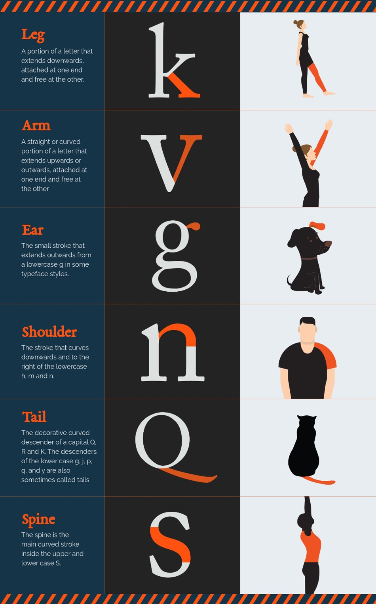


<div style="page-break-after: always;"></div>

# 2. Ako typografia ovplyvňuje správanie zákazníkov

>Výber typografie a samotného fontu ovplyvňuje spôsob, akým zákazníci vnímajú vašu značku a ako o nej premýšľajú. Už len nevyhnutné rozhodnutia pri výbere typu a veľkosti fontu dokážu ovplyvniť komunikáciu značky s jej zákazníkmi. Samotný text a obsah určujú jej osobnosť a to, ako sa zákazník pozerá na produkt alebo službu a aká je pravdepodobnosť, že urobí nákup.

>Rovnako ako výber typografie výrazne ovplyvňuje emócie zákazníkov použitá farba. Červená farba má napríklad schopnosť ovplyvniť a stimulovať chuť do jedla, o čom nájdete aj množstvo štúdií. Veľa značiek potravín preto používa pri typografii práve červenú farbu.

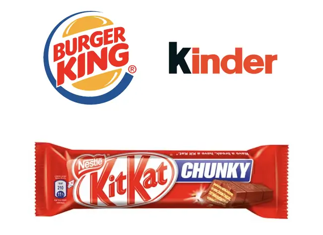

>Vieme, že výber červenej farby v typografii, napríklad v logu, je vhodnou voľbou pre potraviny. Červená farba by bola naopak nevhodnou voľbou pre obchod zameraný na spánok, ako napríklad obchod s posteľami alebo matracmi. Dôvod je jasný, keďže červená farba prináša akciu a vzrušenie, vzbudzuje pocit naliehavosti a povzbudzuje k rýchlemu rozhodovaniu. Červená farba sa preto často používa v reklame, pri výpredajoch alebo aj pri dopravných značkách.


*<p class="important">"Farby sú dôležité !"</p>*


>Podstatné je nepreháňať to pri hraní sa s colorpickerom. Netvrdíme, že web plný rozmanitých a žiarivých farieb nemôže plniť svoju funkciu viac než dobre. Istejšie však bude držať sa jednotnej farebnej schémy, ktorú poväčšine určia korporátne farby vašej firmy či logo.

>Pokiaľ ide o čitateľnosť textu, dôležitejším než farba je kontrast. Svetlomodré písmo na žltom podklade nebude nikoho dlho baviť. Všeobecne platí, že tmavé písmo na bielom podklade je čitateľsky príjemnejšie, než bledé písmo na tmavom podklade. Na druhej strane sa čierny text na bielom pozadí dnes považuje za príliš náročný pre oči a skôr sa odporúča zvoliť kontrast jemnejší. Preto na väčšine blogov dnes nájdete stredne šedé písmo na bielom pozadí, prípadne čierny text na jemnej šedej.

>V grafickom dizajne existujú dva pojmy - user experience a user interface. User experience hovorí o intuitívnosti dizajnu, o tom, ako by stránka mala byť ľahko použiteľná pre všetkých a ako by všetky ikony mali signalizovať to, čo skutočne robia. Na základný návrh user experience sa väčšinou používajú prototypy a wireframy.

>Naopak, user interface hovorí o tom, ako stránka, poprípade aplikácia vyzerá. Hovorí o tom, či je dizajnovo moderná a či má konzistentný design language. Na stránke by sa nám nemali meniť hlavné farby, ktoré používame. Tiež by sa nám nemala veľmi meniť rozloha stránky bez akéhokoľvek používateľského vstupu.


# 3. Základné pojmy typografie
>### JavaScript
>- skriptovací programovací jazyk. Jazyk je používaný najmä pri tvorbe webových stránok.

>### PHP 
>- open source programovací jazyk, ktorý sa používa najmä na programovanie klient-server aplikácií a pre vývoj dynamických webových stránok.

>### Html 
>- hypertextový značkovací jazyk je značkovací jazyk určený na vytváranie webových stránok a iných informácií zobraziteľných vo webovom prehliadači.

>### CSS 
>- kaskádové štýly alebo CSS je všeobecné rozšírenie (X)HTML. Konzorcium W3C označuje CSS ako jednoduchý mechanizmus na vizuálne formátovanie internetových dokumentov.

>### Open source 
>- softvér, ktorý je distribuovaný s jeho zdrojovým kódom, sprístupňuje ho na použitie, úpravu a distribúciu s jeho pôvodnými právami.

>### Front-end 
>- predná časť stránky - tá, ktorú vidíme.

>### Back-end 
>- zadná časť stránky - tá, ktorú nevidíme. Jedná sa o všetko, čo sa deje na pozadí.

>### Bootstrap 
>- otvorená knižnica Javascriptových, CSS a HTML nástrojov pre tvorbu responzívneho webového dizajnu.

>### 404 
>- chybový kód, ktorý hovorí o tom, že súbor alebo služba nebola nájdená. Responzívny web - web ktorý sa vie automaticky prispôsobiť zariadeniu, na ktorom je zobrazený.

>### Cache 
>- je malá, ale rýchla vyrovnávacia pamäť, ktorá slúži na prechodné ukladanie dát alebo sekvencií programu.


>### CMS 
>-  serverový systém, ktorého úlohou je spravovať, archivovať, vytvárať a prezentovať obsah a dáta používateľovi web stránky.

>### Flaticon
>- webová databáza, ktorá ponúka pre web dizajnérov rôzne ikony.

>### Pixabay 
>- webová stránka, ktorá umožňuje web dizajnérom kvalitné fotky/obrázky

>### Wireframe 
>- pomáhajú pri návrhu dizajnu, obsahu i funkcií webových stránok. Bývajú jedným z prvých výstupov, ktoré sa prezentujú klientovi, aby pochopil rozmiestneniu a forme projektu stránky. 

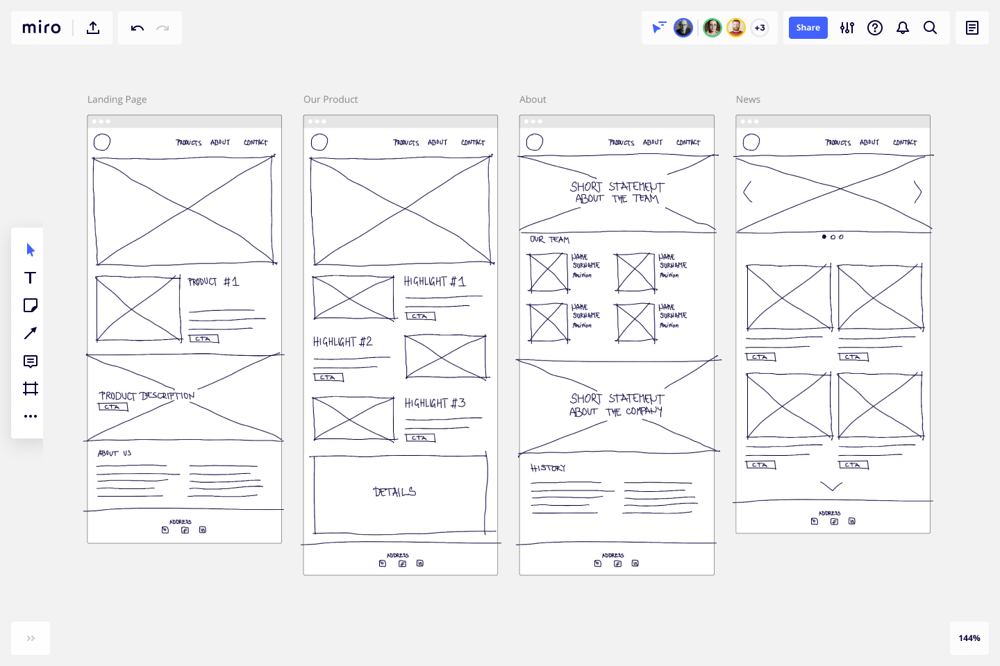

>### WYSIWYG 
>- princíp verného prenosu vizuálnej informácie, resp. informácie modelovanej na počítači do reality tak, že zodpovedá presne modelovanému obrazu s čo najmenším, resp. nebadateľným skreslením.

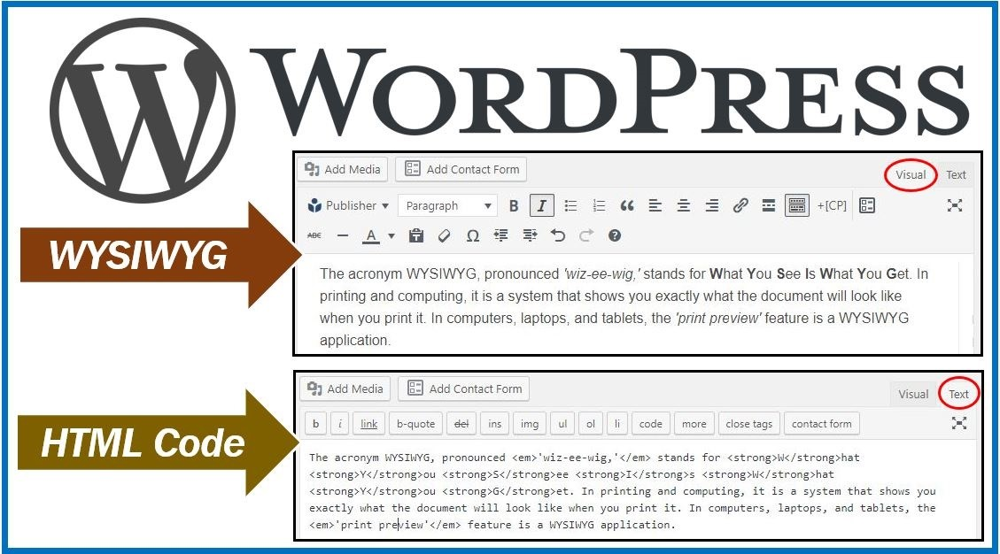


# 4. Jazyky používané pri tvorbe webu
## JavaScript 
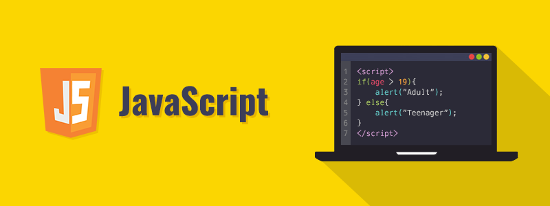

>Tento programový jazyk našiel svoje uplatnenie na webe len v posledných rokoch, ale je stále viac a viac populárny. Je neoddeliteľnou súčasťou všetkých moderných webov. Trošku si teda povedzme o vzniku tohto jazyka, pretože len tak pochopíme, za akým účelom bol vytvorený a na čo mal slúžiť. Vznik jazyka je úzko spojený so vznikom jazyku Java. Jeho cieľom je tvoriť prenosné programy medzi rôznymi operačnými systémami a dokonca medzi rôznymi architektúrami. Mal by mať taktiež jednoduchý syntax a mal obsahovať viac funkcií ako jeho predchodcovia, napríklad C++.

>Prehliadače v 90. rokoch dokázali zobrazovať len statický HTML obsah. Nebolo možné na web vkladať žiadne interaktívne prvky. To sa teda muselo zmeniť a na rad prichádza JavaScript, ktorý sa implementuje do vtedy najrozšírenejšieho prehliadača Internet Explorer. Implementácia bola však problematická, pretože každý internetový prehliadač si ju robil sám, a tak nebola štandardizovaná. V dnešnej dobe sa táto situácia zlepšila najmä vytvorením JavaScriptových frameworkov, ktoré poskytujú unifikované rozhranie a riešia odchýlky v rôznych prehliadačoch. Masívne rozšírenie JavaScriptu sa pripisuje firme Google, ktorá pri svojej aplikácií Gmail používa technológiu AJAX, ktorá je založená na JavaScripte.

>JavaScript má jednu dôležitú vlastnosť, ktorá ho odlišuje od iných programovacích jazykov. Umožňuje totiž načítanie časti webových stránok bez nutnosti obnovenia okna. Nemusíte tak prejsť na novú stránku alebo počkať, kým sa Vám celý obsah znovu načíta. Dôležité je si uvedomiť, že všetky aplikácie s použitím JavaScriptu bežia na strane klienta a sú teda spúšťané v prehliadači u užívateľa. Toto je obrovský rozdiel oproti iným jazykom, ako je napríklad PHP. Ponúka sa tak možnosť tvorba dynamického menu či pridávanie rôznych kontajnerov, ktoré umožňujú ušetriť miesto na stránke, keďže sa napríklad roztvoria len prejdením myškou cez nich. Je to veľmi šikovné a prehľadné. JavaScript je skvelý pre formátovanie textu alebo tvorbu rôznych efektov.

>JavaScript sa zaraďuje medzi jazyky interpretované, čo znamená, že je vykonávaný podľa svojho zdrojového kódu. Jazyk obsahuje iba jeden numerický typ, string pre text, boolean pre pravdivostnú hodnotu a object pre čokoľvek iné. Tím, že zdrojový kód sa ukladá u klienta, môže ho každý zobraziť, prepísať alebo uložiť.

<br>

## PHP
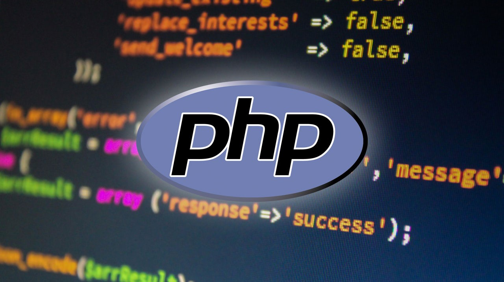

>PHP je skriptovací jazyk, ktorý je vykonávaný na strane serveru a vkladaný do bežného HTML kódu. Čo to znamená? Každú stránku, ktorá obsahuje PHP skripty, server najprv zoberie a vykoná všetky príkazy v PHP, ktoré sú na stránke uvedené. Neskôr pošle klientovi už čistý HTML kód, ktorý je výsledkom bežania skriptu. Príkazy PHP sú vkladané priamo do HTML kódu a sú oddelené tagmi.

>PHP je veľmi všestranný jazyk, v ktorom sa dá relatívne ľahko naprogramovať spravodajský server alebo online obchod. Dáta sa môžu ukladať buď do obyčajných textových súborov alebo do databázy. Hračkou je spracovávanie dát z formulárov, jednoducho vytvoríte rôzne online testy alebo naprogramujete kvalitný reklamný systém.

>PHP kód sa píše priamo do stránky, podobne ako HTML. Aby sa teda poznalo, odkiaľ až pokiaľ PHP siaha, je nutné označiť nejaký začiatok a koniec skriptu. Súbory PHP sa ukladajú s príponou .php nie na disk, ale na webovú adresu, kde je Vaša stránka na webe uložená. Ak máte na Vašej stránke PHP kód, mali by ste po jej načítaní vidieť už iba konečný vložený text, ktorý by sa mal zobraziť bez PHP kódu. Tento sa spracoval na serveri a už je vidno iba jeho výstup. Samotné príkazy sa oddeľujú bodkočiarkou a pre lepšiu prehľadnosť píšeme každý príkaz do nového riadku, aj keď to PHP priamo nevyžaduje. Naopak, ak zabudneme bodkočiarku nastáva problém a práve toto býva častým dôvodom pre chybové hlášky. Z tohto dôvodu je lepšie používať editor, ktorý takéto chyby v syntaxe identifikuje predtým, než nahráte súbor na Vašu webstránku.

>Aby sa uľahčila identifikácia jednotlivých príkazov, je možné do skriptu pridať pomocou dvoch lomítok na začiatku komentár, ktorý sa pri spracovaní skriptu ignoruje a slúži napríklad pri testovaní, ak chcete označiť zmenu kódu. Ďalším prvkom kódu sú príkazy. Základných príkazov je niekoľko a medzi nich určite patrí Echo. Echo vpisuje text do stránky. Druhým významným príkazom je Include. Tento príkaz vloží do stránky obsah zadaného súboru. Je to teda napríklad spôsob, ako mať spoločnú hlavičku webu v jednom súbore a vkladať ho do všetkých stránok. Existuje taktiež príkaz Require, ktorý funguje úplne rovnako ako príkaz Include. Jediný rozdiel je v prípade, keď vkladaný súbor neexistuje. Pri príkaze Include sa vygeneruje varovanie a pokračuje sa v načítavaní skriptu, zatiaľ čo pri príkaze Require sa vygeneruje fatálna chyba a ukončí sa spracovanie skriptu.

>Každá HTML stránka by mala mať hlavičku, ktorá obsahuje minimálne titulok a zvyčajne aj definíciu s kódovaním. Na úplnom začiatku dokumentu je vhodné mať značku Doctype. Na jednom webe si zvyčajne vystačíme s jedným kódovaním a titulkom.

>Pozrime sa ešte na jednu časť PHP jazyka a to je funkcia. Funkcia je oddelenie kusu kódu, ktorý má svoje meno a práve podľa tohto mena sa dá spustiť. Jedným spustením príkazu funkcie sa dá spustiť nejaký zložitejší výpočet, a to z rôznych miest, bez toho, aby sme zakaždým museli vypísať všetky príkazy tohto výpočtu. Funkciu spustíme uvedením jej názvu, ktorý je nasledovaný guľatými zátvorkami a ukončený bodkočiarkou.


<br>

## HTML a CSS
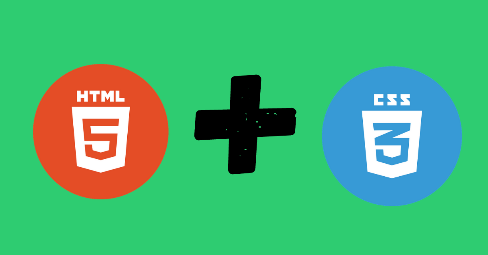


>HTML, po anglicky HyperText Markup Language, poskytuje obsahovú štruktúru a význam webstránky tým, že definuje jej obsah, akým sú napríklad nadpisy, odseky alebo obrázky. CSS je programovací jazyk vytvorený na tvorenie vzhľadu obsahu, napríklad pomocou písma alebo farieb.

>Tieto dva jazyky – HTML a CSS – sú navzájom nezávislé. CSS by nemalo byť zapísané do dokumentu HTML a naopak. HTML bude spravidla vždy predstavovať obsah a CSS bude vždy predstavovať vzhľad tohto obsahu. S týmto porozumením rozdielu medzi HTML a CSS sa podrobnejšie pozrieme na jazyk HTML.

>Pri začatí používania jazyka HTML sa pravdepodobne stretnete s novými a často podivnými výrazmi. Tri základné HTML pojmy, ktoré by ste mali začať používať sú elementy, tagy a atribúty.

>Elementy sú označenia, ktoré definujú štruktúru a obsah objektov v rámci stránky. Niektoré z najčastejšie používaných prvkov zahŕňajú viaceré úrovne nadpisov a odseky. Elementy sú identifikované použitím uholníkov <>, ktoré obklopujú názov prvku. Tagy sa najčastejšie vyskytujú v pároch otváracích a uzatváracích elementov.

>Obsah, ktorý spadá medzi tieto dva tagy je obsahom tohto prvku. Atribúty označujú prvky, ktoré slúžia na poskytovanie dodatočných informácií o elemente. Medzi najbežnejšie atribúty patrí atribút id, ktorý identifikuje prvok; Atribút class, ktorý klasifikuje prvok; Atribút src, ktorý špecifikuje zdroj pre vložený obsah; a atribút href, ktorý poskytuje hypertextový odkaz na prepojený obsah. Atribúty sú definované v úvodnom tagu po názve elementu. Formát týchto atribútov pozostáva z názvu atribútu, za ktorým nasleduje znamienko rovnosti a potom hodnota atribútu. XHTML je variant HTML, ktorý používa syntax XML, po anglicky Extensible Markup Language. XHTML má všetky rovnaké elementy ako variant HTML, ale v syntaxe sa mierne líši.

>Dokumenty HTML sú textové dokumenty uložené pomocou prípony súboru .html. Ak chcete začať písať HTML, potrebujete textový editor akým je napríklad Poznámkový blok pre Windows a TextWrangler pre Mac. 

>CSS je programovací jazyk, ktorý určuje vzhľad webových stránok vrátane farieb, rozloženia a písma. Umožňuje prispôsobiť prezentáciu stránky rôznym typom zariadení, ako sú veľké obrazovky, malé obrazovky alebo tlačiarne. CSS je nezávislé na jazyku HTML a môže sa používať s ktorýmkoľvek programovacím jazykom založeným na jazyku XML. Oddelenie kódu HTML od CSS uľahčuje udržiavanie webových stránok, zdieľanie štýlov na rôznych stránkach a prispôsobenie stránok rôznym podmienkam. Toto sa označuje ako oddelenie štruktúry (alebo obsahu) od prezentácie.


<br>

# 5. Rozlozenie a prvky stranky
  
>## F pattern vs Z pattern
>
>Existujú dva základné vzory:
>>	Dizajn v tvare F.
>
>>	Dizajn v tvare Z.
>
>Tepelné mapy ukázali, že pohyb očí používateľov sa riadi vzorom v tvare F. Ľudia začínajú zľava hore a potom sa pohybujú doprava. Potom idú zľava dole a opäť sa pohybujú vodorovne a potom zľava dole a vytvárajú tvar F.
>
>Preto by sa na túto cestu mali postaviť najdôležitejšie veci. Najdôležitejšia pozícia je vľavo hore, čo je dôvod, prečo sú tam umiestnené logá. Tvar F je dôvod, prečo je ponuka vodorovne umiestnená hore.

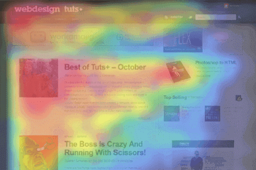


>Na vyššie uvedenom obrázku môžeme vidieť F vzor vo farbe Červená / žltá / oranžová. Takto čítajú používatelia a väčšina webových stránok s obsahom je iba v tomto formáte.

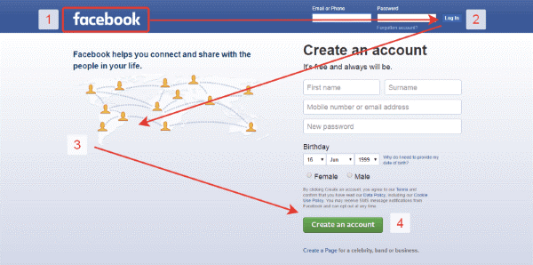

>Dizajn v tvare Z sa používa na webových stránkach s niekoľkými rozhodujúcimi komponentmi, ktoré majú upútať pozornosť klienta. Pozdravné stránky často využívajú dizajn v tvare Z. Vidíme, že stránka na Facebooku sa riadi vzorom Z.


 
## Single page application
 >(SPA) je webová aplikácia nebo webová stránka, ktorá komunikuje s používateľom tak, že dynamicky prepisuje aktuálnu webovou stránku novými dátami z webového serveru namiesto predvoleného spôsobu načítania celých nových stránok webovým prehliadačom. Cieľom sú rýchlejšie prechody, vďaka čomu sa webové stránky viac podobajú natívnej aplikácii.
>
> V rámci SPA nikdy nedochádza k obnovení stránky; namiesto toho sú všetky potrebné kódy HTML, JavaScript a CSS buď načítané prehliadačom pri jedinom načítaní stránky,[1] alebo sú príslušné zdroje dynamicky načítané a pridané na stránku podľa potreby, 

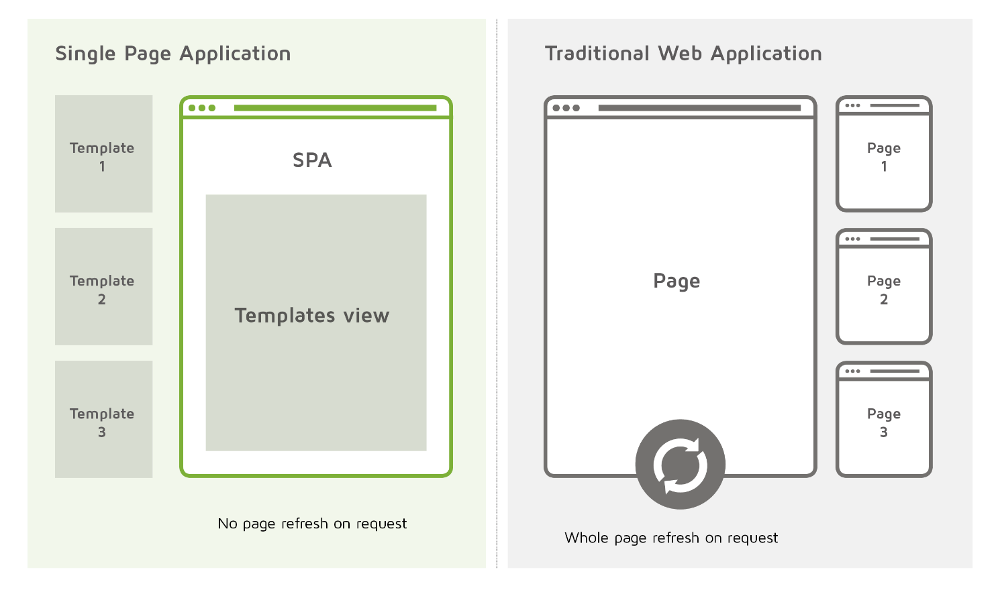

 
## Personalne portfolio vs eshop

 
> Vaše logo je vaša značka, váš slogan je to, kto ste. V dobe internetu s krátkou dobou pozornosti musíte byť schopní upútať pozornosť a veľmi rýchlo odpovedať na otázku "prečo?". Inak návštevník veľmi rýchlo klikne na tlačidlo späť.

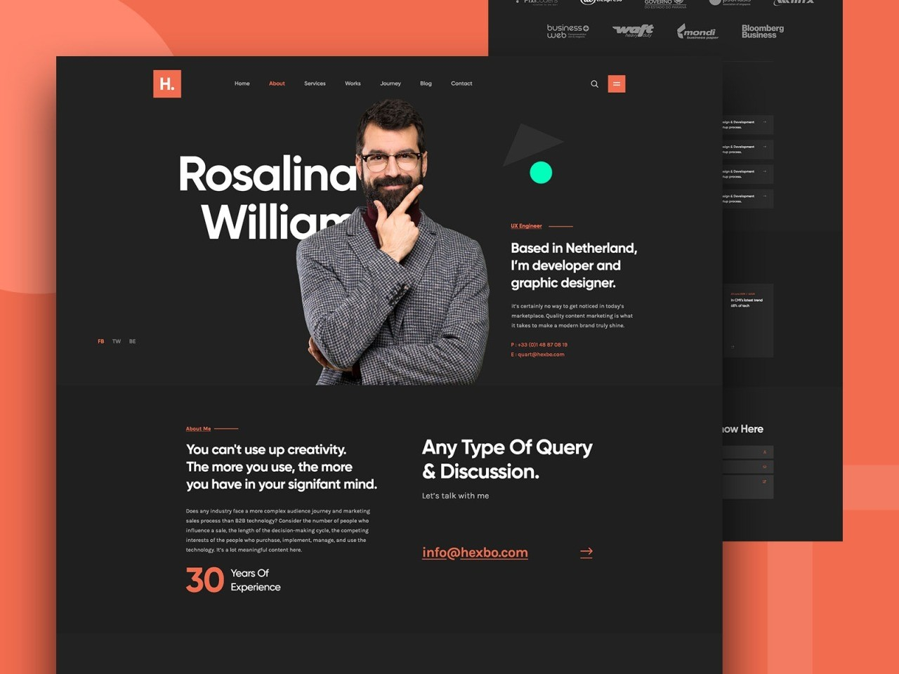

>ani tá najlepšia webová stránka neznamená nič, ak sa na nej ťažko orientuje. Ak sa nedá ľahko dostať k príkladom vašej práce alebo sa s vami rýchlo skontaktovať, potom nezáleží na tom, aká dobrá je vaša práca: návštevník bude potenciálne frustrovaný a skúsi iného dizajnéra.
>
>Predstavte si svoje portfólio ako album najväčších hitov. Ukážte len tie najlepšie, najpôsobivejšie a najreprezentatívnejšie práce, a menej významné ukážky z portfólia vynechajte. Tak ako bezchybný album najväčších hitov okamžite urobí z nového poslucháča fanúšika, tak bezchybné portfólio dizajnu môže okamžite zapôsobiť na nového potenciálneho klienta a zaujať ho.


>Jedným z hlavných pravidiel, ktoré by ste mali mať na pamäti počas procesu navrhovania elektronického obchodu, je aby dizajn  bol jednoduchý.
>
>Keď ide o návrh webovej stránky elektronického obchodu, jednoduché je vždy lepšie. Čím viac prvkov na stránke máte (farby Bannerové reklamy Všetky POP-UPS), tým viac to odvádza pozornosť od celého zmyslu webovej stránky - uzatvorenia predaja.
>
>Na webovej stránke elektronického obchodu nepotrebujete množstvo zvončekov a píšťaliek - len odvádzajú pozornosť. Udržujte dizajn jasný, čistý a jednoduchý - a sústreďte sa na predaj.
>
>Výber farieb pre váš web elektronického obchodu je viac ako len povedať: "Červená je moja obľúbená farba, tak... nech sú všetky veci červené!" Farba je mimoriadne mocný nástroj - a ak rozumiete psychológii farieb, môžete ju využiť vo svoj prospech (a zvýšiť tak predaj).
>
>Rôzne farby môžu v ľuďoch vzbudiť rôzne pocity, emócie a akcie - takže ak chcete, aby vaše stránky elektronického obchodu konvertovali, musíte tieto farebné inšpirácie využiť vo svoj prospech.
>
>Ak teda napríklad chcete, aby ľudia nakúpili, nechajte tlačidlo nákupu vyniknúť jasnou farbou, napríklad červenou. Podľa psychológie farieb červená farba vzbudzuje pocity vzrušenia a vášne, ktoré sú hnacími faktormi výdavkov - a štúdie ukazujú, že ak je tlačidlo červené, môže zvýšiť konverzie o neuveriteľných 34 %.
>
>Ak chcete zvýšiť svoju dôveryhodnosť, zakomponujte do dizajnu webu modrú farbu. Modrá je nielen všeobecne obľúbená farba, ale je tiež dokázané, že zvyšuje pocit dôvery, vďaka čomu je v obchodnom svete obľúbená (nie nadarmo sa modrá farba objavuje vo viac ako polovici všetkých log).
>
>Podstatné je, že farba je jedným z najsilnejších nástrojov v súprave nástrojov dizajnu - a ak ju viete používať, môže mať obrovský vplyv na dizajn vášho elektronického obchodu.

## Zlaty rez

>Ide o matematickú rovnicu, s ktorou sa pracuje v pomere 1:1,618. Má predstavovať dokonalú harmóniu pre ľudské oko. Rozvinul ju matematik Fibonacci, ktorý sa venoval zákonitostiam postupnosti (Fibonacciho postupnosť). Platí, že každé číslo je súčtom dvoch predchádzajúcich:
>
>1, 1, 2, 3, 5, 8, 13, 21, 34, 55, 89, ...

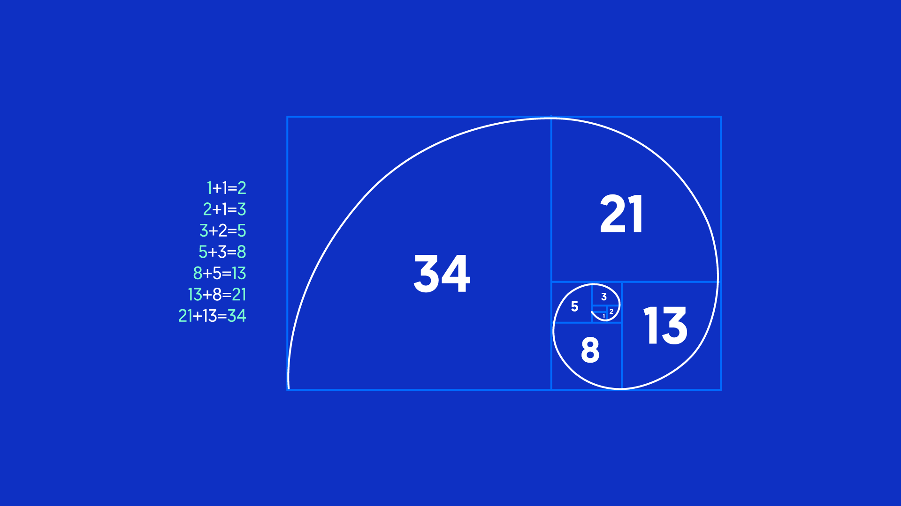


>Využitie zlatého rezu v digitálnej tvorbe
>
> Základom efektívneho digitálneho prostredia je správna kompozícia prvkov. Poznatky používania zlatého rezu nám ukazujú, ako vytvoriť balans medzi elementami, či zachovať správne proporcie a kontrast medzi nimi. V čom nám ešte môže zlatý rez pomôcť?

## Kompozícia a kontrasty vo wireframe modeloch

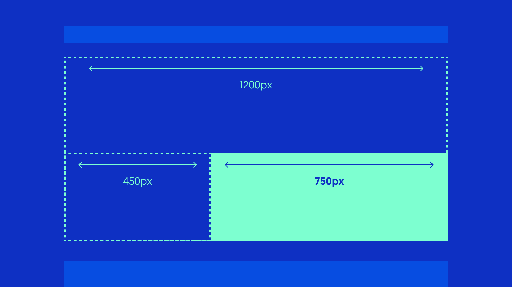


> Ako bolo už spomenuté, zlatý rez zodpovedá pomeru približne 1:1,6. Tento fakt môžeme aplikovať na ľubovoľnú časť nášho wireframe-u, kde chceme dosiahnuť vyváženú kompozíciu.
 
 


## Logo stranky klikatelne

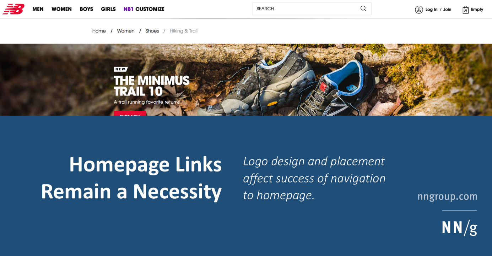


> Logá webových stránok by mali odkazovať na domovskú stránku.
>
> Toto odporúčanie je dlhodobou webovou konvenciou. Postupom času sa mnohí ľudia na základe pokusov a omylov naučili, že kliknutie na logo webovej lokality ich vedie späť na domovskú stránku. Dodržiavanie tohto štandardu na vašom webe znižuje zmätok tým, že prispôsobuje používateľské rozhranie očakávaniam používateľov.
>
> Umiestnite logo na štandardné miesto: vľavo hore.
>
> Logo zarovnané vľavo je najznámejšie umiestnenie a používatelia ho tam hľadajú. Toto očakávanie je také silné, že odklon od tohto naučeného vzoru môže spôsobiť značné škody.
 
## Slider vs banner

> Keďže posuvný banner je pokročilejšou voľbou, pokiaľ ide o vývoj, je jednoduchšie zamerať sa na pozitíva a negatíva, ktoré pridanie tejto funkcie môže poskytnúť. Jedným z veľkých prínosov používania carouselu v rámci dizajnu webovej stránky je, že máte možnosť nasadiť rôzne kľúčové posolstvá veľmi vizuálnym spôsobom, ale bez vertikálneho rozšírenia webovej stránky. Následným efektom je, že tieto správy sa nezobrazia okamžite, čo znamená, že používateľ musí buď čakať, kým sa snímka zobrazí, alebo si ju musí vybrať sám - čo môže, ale nemusí urobiť. ? 

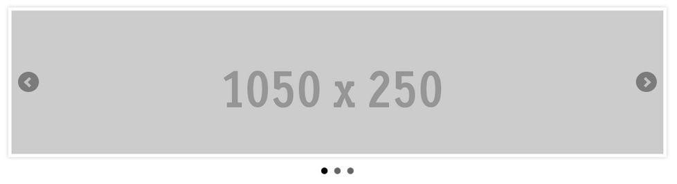


<br>


# 6. optimalizacia obrazkov
>Optimalizácia obrázkov spočíva v čo najväčšom znížení veľkosti súborov obrázkov bez straty kvality, aby čas načítania stránky zostal nízky. Ide aj o SEO optimalizáciu obrázkov. To znamená, aby sa vaše obrázky produktov a dekoratívne obrázky umiestnili na popredných miestach v Google a iných vyhľadávačoch obrázkov.

## Rozlisenie

> Ukladanie obrázkov na web bolo pre mnohých vždy tak trochu záhadou. Nahrávanie ťažkých obrázkov (pôvodná veľkosť obrázku na šírku 5000px, neoptimalizované obrázky) spôsobí nielen problémy s používateľským zážitkom na vašom webe, ale ovplyvní aj vašu stratégiu SEO (rýchlosť načítania, bounce rate, poradie atď.).
> 
> Rozlíšenie webových obrázkov: Rozlíšenie je kvalita alebo hustota obrázka, ktorá sa meria v bodoch na palec (dpi). Profesionálna tlačiareň môže vyžadovať, aby obrázky mali rozlíšenie aspoň 300 dpi. Väčšina počítačových monitorov však zobrazuje 72 dpi alebo 92 dpi, takže čokoľvek vyššie je zbytočné a zbytočne zväčšuje obrázok. Keď má program na navrhovanie možnosť "uložiť pre web", znamená to, že ho uložíte v nízkom rozlíšení vhodnom pre web.


## Pouzitie CDN

> Sieť na doručovanie obsahu (CDN) označuje geograficky rozmiestnenú skupinu serverov, ktoré spolupracujú s cieľom zabezpečiť rýchle doručovanie internetového obsahu.
> 
> CDN umožňuje rýchly prenos prostriedkov potrebných na načítanie internetového obsahu vrátane stránok HTML, súborov javascript, súborov štýlov, obrázkov a videí. Popularita služieb CDN neustále rastie a v súčasnosti sa väčšina webovej prevádzky zabezpečuje prostredníctvom CDN vrátane prevádzky z veľkých webových lokalít, ako sú Facebook, Netflix a Amazon.
>
> Správne nakonfigurovaná sieť CDN môže tiež pomôcť chrániť webové stránky pred niektorými bežnými škodlivými útokmi, ako sú napríklad útoky DDOS (Distributed Denial of Service).


<div style="page-break-after: always;"></div>

# Zdroje

>https://comsyco.sk/, https://kremsa.sk/typografia-na-webe-preco-ste-ju-nemali-podcenit/, 
>
>https://www.ecommercebridge.sk/typografia-ako-sucast-uspesneho-online-riesenia/ 
>
>https://www.megalogo.sk/blog/vyznam-typografie-v-logu
>
>https://cs.wikipedia.org/wiki/Serif
>
>https://cs.wikipedia.org/wiki/Bezpatkov%C3%A9_p%C3%ADsmo
>
>https://cs.wikipedia.org/wiki/Neproporcion%C3%A1ln%C3%AD_p%C3%ADsmo
>
>https://animagraf.sk/blog/4-zakladne-pravidla-typografie-webe/
>
>https://visme.co/blog/wp-content/uploads/2017/11/A-Visual-Guide-to-the-Anatomy-of-Typography-Infographic.jpg
>
>https://www.typocon.sk/blog/clanok/zakladne-typy-pisma


